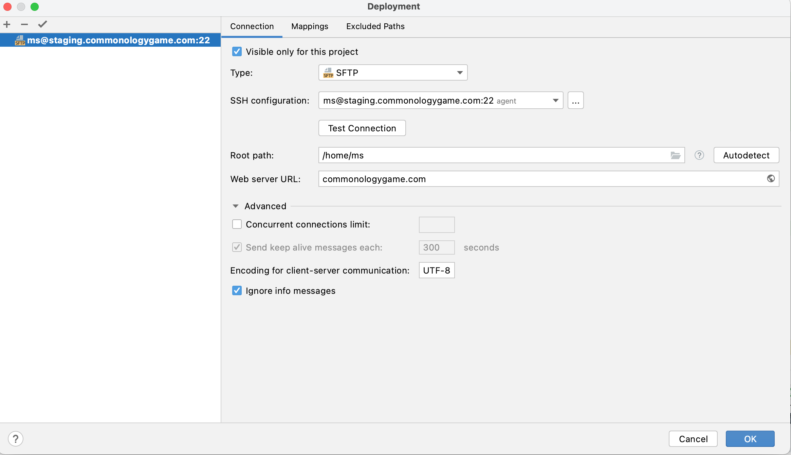
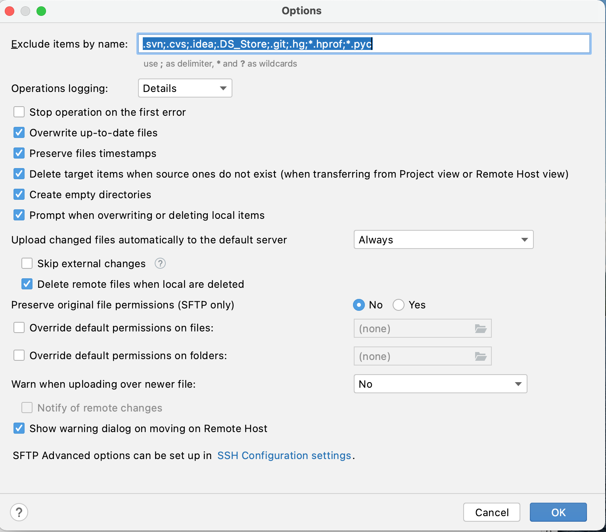

# Set up remote staging account for individual developers


This file explains how to set up a single developers account on the staging server.
The developer can then use PyCharm on their localhost desktop using ssh in the
background to sync files to the staging server.  We have a couple of convenient scripts
for updating the developers database on the staging server and for remote starting the
the Django runserver.  Each developer has their own account on the staging server
with a postgres database named for the accounts username.  This way all users can
stage new work on the server and run independent servers.

**Throughout this document the example user account name is "ms".**

## Create a users account on the staging server.

```shell
# adduser ms
# cp -R /home/django/.ssh /home/ms/
# cd /home/ms
# chown -R ms:ms .ssh
# exit
$ exit
```

## Set up users account

The `pyenv install` command here can take a long time, maybe even 10 minutes.

```shell
$ ssh ms@staging.commonologygame.com
$ curl https://pyenv.run | bash
$ pyenv install 3.9.4
$ pyenv shell 3.9.4
$ pyenv virtualenv project
```

Add these lines to the end of `~/.bashrc`:

```shell
export PATH="~/.pyenv/bin:$PATH"
eval "$(pyenv init -)"
eval "$(pyenv virtualenv-init -)"

# This determines the postgres database name used
export PROJECT_NAME=ms
```

Clone repo.

```shell
$ cd ~
$ git clone git@github.com:quizitive/commonology.git
```

## Set up Pycharm to sync files

Use the `Tools->Deployment->Configuration...` to set up the server.



Use the `Tools->Deployment->Options` like this.



You may then choose to automatically keep files up to
date by selecting `Tools->Deployment->Automatic Upload (Always)`.
There are other choices in `Tools->Deployment` for manually uploading files.

## Useful commands

All of these would be run from the developers localhost. 


### To update database for django account:
```shell
ssh django@staging.commonologygame.com bash commonology/scripts/pg_update_dev_db.bash
```

### To update database for ms account:
```shell
ssh ms@staging.commonologygame.com bash commonology/scripts/pg_update_dev_db.bash ms
```

### To run a staging server in the ms account:

```shell
ssh -t -L8020:localhost:8020 ms@staging.commonologygame.com bash commonology/scripts/run_user_server.bash
```

or for "ted" account with a different port number:

```shell
ssh -t -L8030:localhost:8030 ted@staging.commonologygame.com bash commonology/scripts/run_user_server.bash
```

#### To deploy master branch to staging:

```shell
ssh django@staging.commonologygame.com commonology/deploy.bash master
```

### To deploy master branch to production:

```shell
ssh django@commonologygame.com /home/django/commonology/deploy.bash"
```
